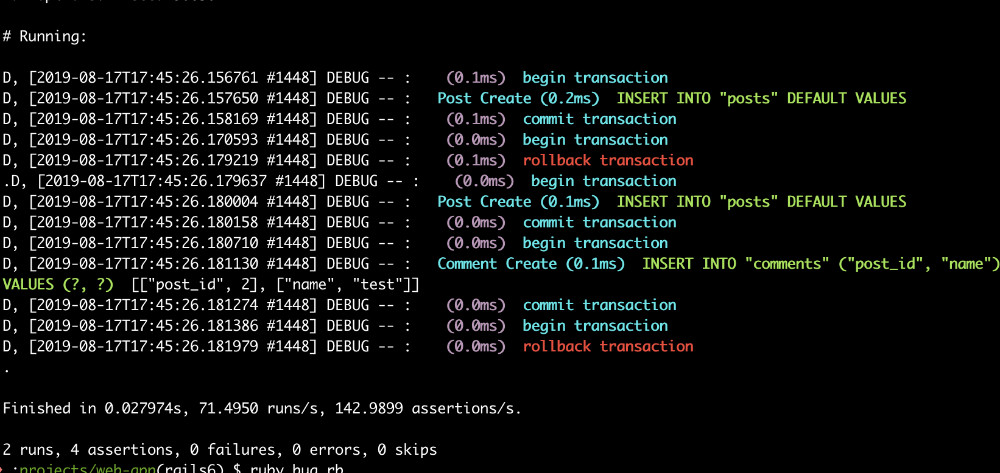
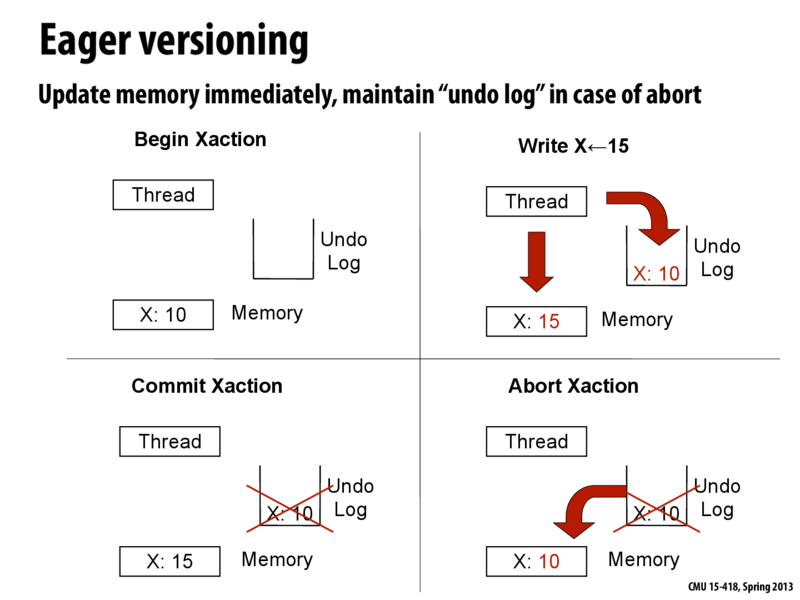
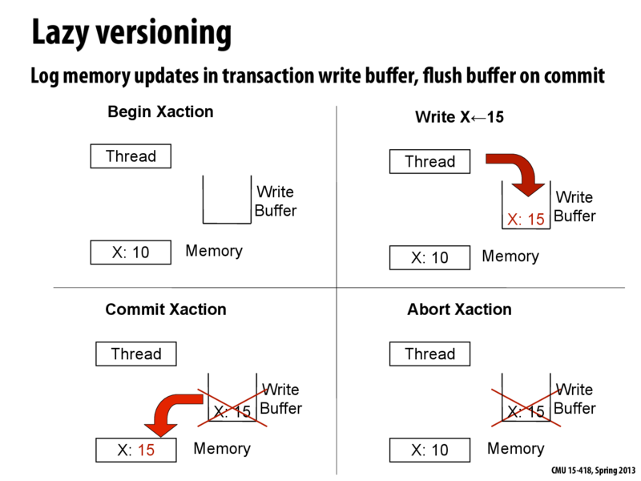

In my first post, I said that concurrency in Ruby required a post of its own with a special mention of its implementation in MRI. This post will cover some core concepts of concurrency that have helped scripting languages, specifically Ruby, to become more performant in CPU-intensive multi-threaded applications.

The past few weeks have kept me quite busy with coursework and my class - _"Comparative Study of Programming Languages"_ has had me appreciating the fact that most programming languages have distinguishable traits that make them an optimum choice for specific applications. For instance, Erlang is quite intuitive for applications requiring concurrency; LISP (and its dialects) for applications requiring efficient and effective processing of symbolic information (great for AI);
C for system programming owing to its access to lower-level system APIs and so on.

## What really is the GIL?
The Global Interpreter Lock or Giant VM Lock (GVL) is simply a VM-wide mutex that a thread needs to acquire in order to run. In other words, every thread, though mapped to a kernel-level thread is still required to acquire the GIL before executing. Consequently, multi-threaded applications that are written in languages that have interpreters using this technique simply aren't being as resourceful or exploitative as they should, especially when running on increasingly ubiquitous multi-core processors. 

_Sidenote_ : The drawbacks that come with GIL exist only on multi-threaded primarily CPU-bound applications written in Ruby (MRI) and are not as obvious with predominantly I/O bound applications because the GIL is released for any blocking I/O (database querying, HTTP requests and the like). 

Following the developments and increased availability of multi-core processors, experiments were undertaken to replace the GIL/GVL and observe the results.

The first approach was to use fine-grained locking with which came obtuse semantics. For those familiar with Java - the stark differences in semantics between programmer-authored mutexes or semaphores around critical sections and the simpler `synchronized` keyword are illustrative of how unfriendly semantics can make programs more error-prone.

## Transactional Memory
An alternative to the previously mentioned approach emerged in the form of transactional memory. A first glance at the idea of transactional memory will immediately seem familiar, especially to those with an understanding of the _ACID_ principle on database transactions. 

#### 
 A transaction logging commits and rollbacks in a Rails application. Multi-threaded  interpreted programs using transactional memory work in a similar way

In simple terms, a compound operation consisting of a sequence of load and store instructions to modify a part of memory optimistically runs; however, when a conflict is observed, there will be a _rollback_ to the initial state _ie_. how things were before the transaction. If no conflict is detected, the transaction is commited. This gives the illusive effect that a sequence of operations happen in a single atomic step. An important aspect of this is that changes made within `begin` and `end` constructs of a transaction are speculative. In the case of lazy data versioning, the actual memory locations that require modification are not modified directly and instead use a write buffer to buffer the data until a successful commit. Eager data versioning on the other hand mutates the actual memory location and logs the changes that would be required for a rollback.

#### 
 Eager data versioning   [Source: Lecture notes from Carnegie Mellon University's 15-418/15-618: Parallel Computer Architecture and Programming, Spring 2013](http://15418.courses.cs.cmu.edu/spring2013content/lectures/20_transactionalmem/images/slide_041.png) 

#### 
 Lazy data versioning   [Source: Lecture notes from Carnegie Mellon University's 15-418/15-618: Parallel Computer Architecture and Programming, Spring 2013](http://15418.courses.cs.cmu.edu/spring2013content/lectures/20_transactionalmem/images/slide_041.png) 

Are there benefits to this approach over fine-grained locking? Probably! The overheads of lower-level thread synchronization mechanisms that are used in fine-grained locking outweigh its improvements over the GIL. More importantly, there is a modest performance boost in terms of parallelism that transactional memory offers because the transaction rolls back and re-runs until it is conflict-free rather than always being cautious and acquiring a lock and/or waiting in a queue to access and modify a shared resource. However, therein, lies both a pro and a con:
- **Pro**: _Deadlocks_ can't really happen because no single thread can end up in a situation where it never releases a lock
- **Con**: _Livelocks_ in large transactions as there could be constant rolling back and re-running (that's what optimism gets you &#128532). 

Various combinations of data versioning strategies and conflict detection strategies (not discussed in this post but are mainly of two types - _optimistic_ and _pessimistic_) yield two broad implementations of transactional memory - _Hardware Transactional Memory (HTM)_ and _Software Transactional Memory (STM)_ and more recently a third, _Hybrid Transactional Memory_.

When _HTM_ was used in place of the GIL in Ruby's interpreter (CRuby/MRI), according to some recorded metrics by IBM Research, it was observed that Ruby on Rails applications experienced speed-ups of upto 1.2 times over the GIL. 

## Other solutions and conclusion
Some groups who have utilized _STM_ as a replacement for the GIL in Ruby for similar experiments have also seen modest performance boosts. _Concurrent Ruby_ and _MagLev_ stand out as prime examples.

I do intend working more on understanding at greater depth the principles of transactional memory and its implementations given how significant it has become over the past decade so consider this post just an introduction to the subject &#128517.

In summary, in order to make scripting languages like Ruby, that use native threads more performant in CPU-intensive and heavily concurrent applications, implementations of Ruby that do not use the GIL may prove to be a better choice.

## References

1. Odaira, R., Castanos, J. and Tomari, H., 2014. Eliminating global interpreter locks in ruby through hardware transactional memory. ACM SIGPLAN Notices, 49(8), pp.131-142.

2. Cs.cmu.edu. 2020. [online] Available at: <https://www.cs.cmu.edu/afs/cs/academic/class/15418-s12/www/lectures/20_transactionalmem.pdf> [Accessed 16 June 2020].

3. En.wikipedia.org. 2020. Transactional Memory. [online] Available at: <https://en.wikipedia.org/wiki/Transactional_memory> [Accessed 16 June 2020].

4. 15418.courses.cs.cmu.edu. 2020. Implementing Transactional Memory : 15-418 Spring 2013. [online] Available at: <http://15418.courses.cs.cmu.edu/spring2013/article/40> [Accessed 16 June 2020].